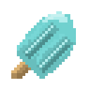
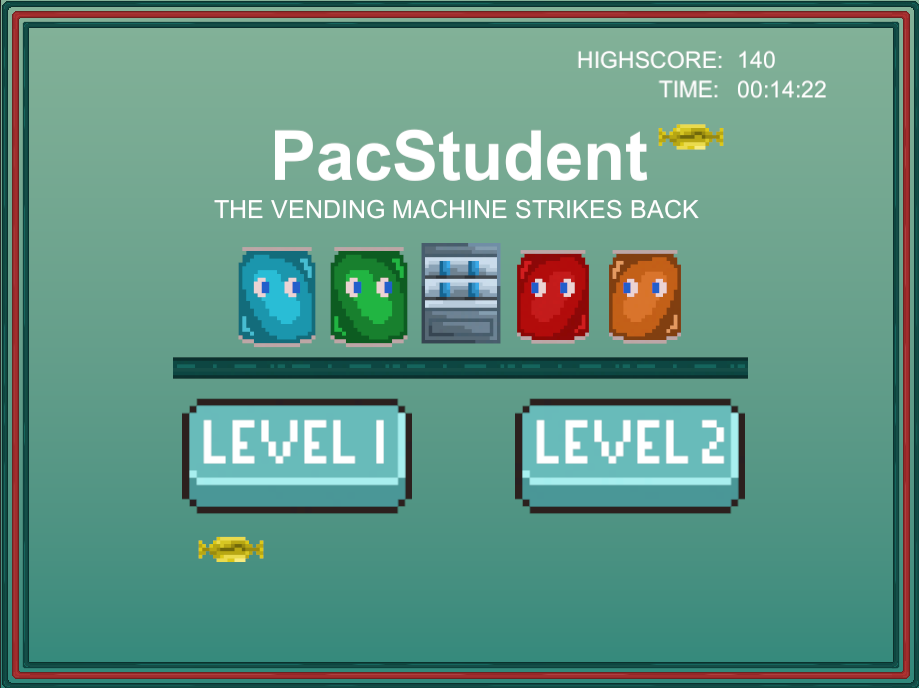
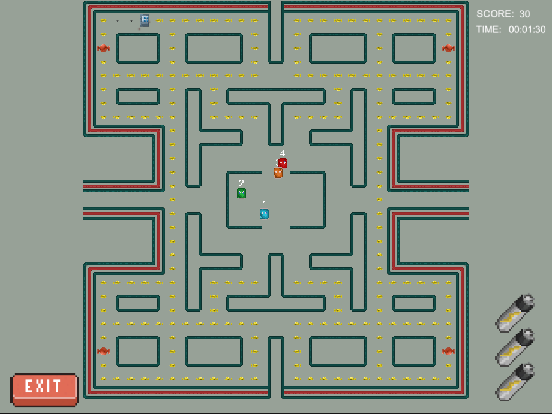

# Pacman Recreated

This project was made with [Unity](https://unity.com) version 2022.2.6f1

## Functionality

- [x] Highscore system
- [x] Time system
- [x] Lives counter
- [x] Tweening movement system
- [x] Player collision
- [x] Sprite animations
- [x] onCollision reactions
- [x] Custom particle systems
- [x] Teleporters
- [x] GhostAI
  - [x] Ghost 1: Move in a random valid direction that is either further or equal distance to the player
  - [x] Ghost 2: Move in a random valid direction that is either closer or equal distance to the player
  - [x] Ghost 3: Move in a random valid direction
  - [x] Ghost 4: Move clockwise around the map
- [x] Level 1 functionality
- [ ] Level 2 functionality

## Screenshots

